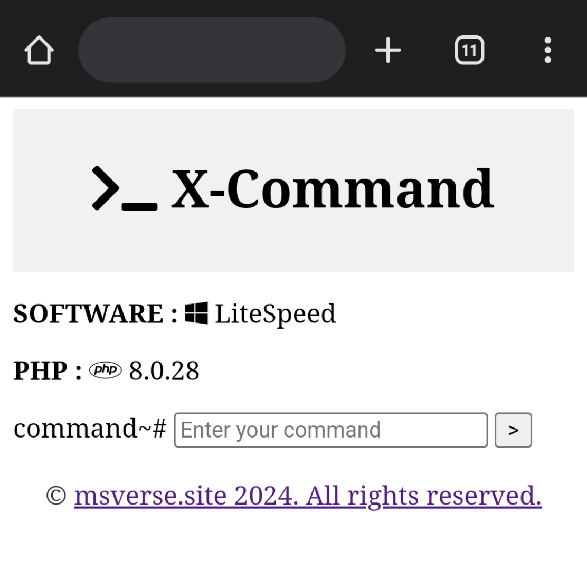

# X-Command
Web Terminal

## Fitur
- Command Line
- Download (command: download file.php)

## Preview
 

## Artikel Terkait
[Artikel X-Command](https://www.msverse.site)

## Tanggung Jawab
Saya, sebagai pembuat script ini, dengan tegas menyatakan bahwa saya tidak bertanggung jawab atas penggunaan atau konsekuensi yang mungkin timbul dari penggunaan script ini.
