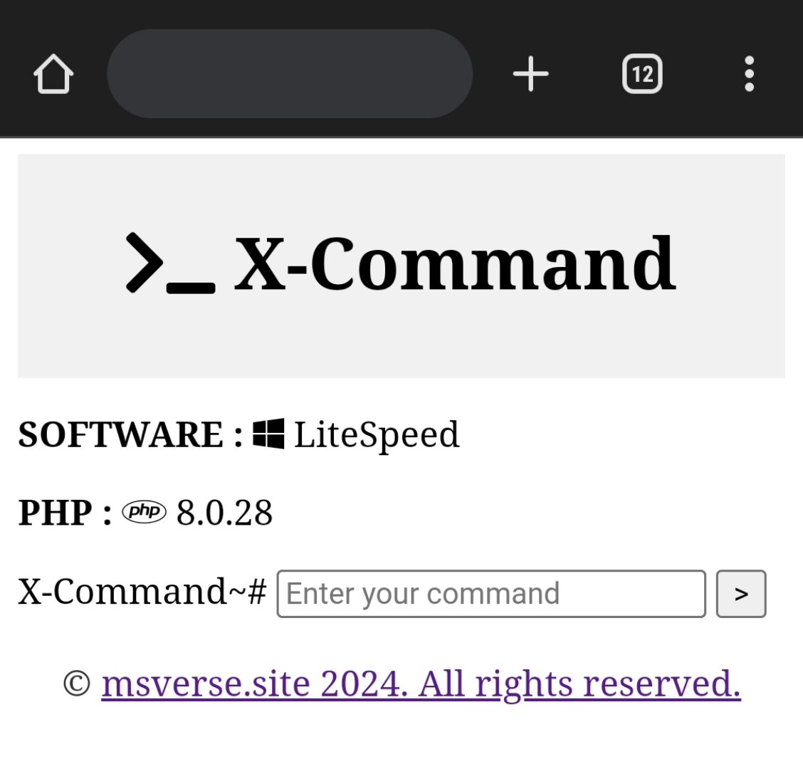

# X-Command
Web Terminal


Anti Malware Scanning Log

HTTP Header Check
```
HTTP/1.1 404 Not Found
Connection: Keep-Alive
Keep-Alive: timeout=5, max=100
x-powered-by: PHP/8.0.28
content-type: text/html; charset=UTF-8
content-length: 726
content-encoding: gzip
vary: Accept-Encoding
date: Sun, 03 Mar 2024 13:25:18 GMT
server: LiteSpeed
platform: hostinger
content-security-policy: upgrade-insecure-requests
alt-svc: h3=":443"; ma=2592000, h3-29=":443"; ma=2592000, h3-Q050=":443"; ma=2592000, h3-Q046=":443"; ma=2592000, h3-Q043=":443"; ma=2592000, quic=":443"; ma=2592000; v="43,46"
```

# Fitur
- Command Line
- Download (command: download file.php)

## Preview
 

## Artikel Terkait
[Artikel X-Command](https://www.msverse.site)

## Tanggung Jawab
Saya, sebagai pembuat script ini, dengan tegas menyatakan bahwa saya tidak bertanggung jawab atas penggunaan atau konsekuensi yang mungkin timbul dari penggunaan script ini.
